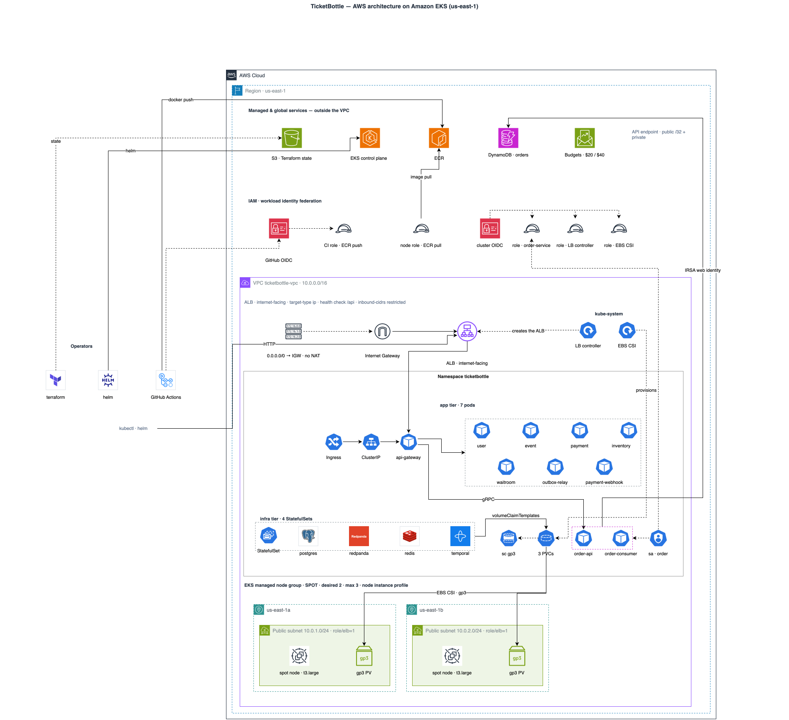

# TicketBottle

A distributed ticket-selling platform built for high-demand on-sales, where thousands of buyers compete for the same inventory in the same few seconds.

[](https://opensource.org/licenses/MIT)
[](https://golang.org/)
[](https://nestjs.com/)
[](https://grpc.io/)
[](https://temporal.io/)
[](https://kafka.apache.org/)
[](https://kubernetes.io/)
[](https://www.terraform.io/)

---

## Contents

- [Overview](#overview)
- [Architecture](#architecture)
- [Services](#services)
- [The purchase flow](#the-purchase-flow)
- [Communication patterns](#communication-patterns)
- [Design decisions](#design-decisions)
- [Repository layout](#repository-layout)
- [Running it locally](#running-it-locally)
- [gRPC contracts](#grpc-contracts)
- [Deployment](#deployment)
- [Observability and security](#observability-and-security)
- [License](#license)

---

## Overview

A ticket on-sale is a worst-case concurrency problem: demand arrives as a spike, the inventory is finite and non-fungible, and every oversell is a refund and a support ticket. TicketBottle addresses that with four mechanisms working in sequence.

- **Virtual waiting room.** Buyers are queued fairly and admitted into checkout a bounded number at a time, so the services behind never see the full spike.
- **Atomic inventory.** Every quantity change happens under a row lock inside a transaction, with a timed hold that abandoned carts release automatically. Two buyers cannot claim the same seat.
- **Orchestrated saga.** A purchase spans three services and three databases, so no single ACID transaction can cover it. A durable Temporal workflow runs the steps and compensates precisely if any of them fails.
- **Transactional outbox.** Payment writes its state change and its outgoing event in the same transaction, so a crash between the two cannot lose the event.

The platform is polyglot by design: Go for the concurrency- and latency-sensitive path, TypeScript/NestJS for the richer business domains.

---

## Architecture

A single HTTP gateway is the only public entry point; every service behind it speaks gRPC. Cross-service notifications travel over Kafka. The diagram below shows the system as deployed on AWS — the workload topology is identical wherever it runs, since one Helm chart serves every target.



---

## Services

Seven services plus two workloads that carry the payment event path.

| Service | Directory | Stack | Port | Protocol | Datastore |
|---------|-----------|-------|------|----------|-----------|
| API Gateway | `services/api-gateway` | TypeScript / NestJS | 3000 | HTTP + REST | none (gRPC client to all) |
| User | `services/user-svc` | TypeScript / NestJS | 50052 | gRPC | PostgreSQL (Prisma) |
| Event | `services/event-svc` | TypeScript / NestJS | 50053 | gRPC | PostgreSQL (Prisma) |
| Order | `services/order-svc` | Go / Temporal | 50054 | gRPC | DynamoDB |
| Payment | `services/payment-svc` | TypeScript / NestJS | 50055 | gRPC | PostgreSQL (Prisma) |
| Waitroom | `services/waitroom-svc` | Go | 50056 | gRPC | Redis |
| Inventory | `services/inventory-svc` | Go / GORM | 50057 | gRPC | PostgreSQL |

**API Gateway** terminates HTTP, validates requests, enforces JWT authentication and rate limits, maps gRPC status codes onto HTTP responses, and translates REST into internal gRPC calls. It owns no database.

**User** handles registration, authentication, profiles, and email verification.

**Event** manages events, organizers, and configuration, with a lifecycle of `DRAFT → CONFIGURED → APPROVED → PUBLISHED` and role-based access control.

**Order** is the saga orchestrator. Temporal workflows (`CreateOrder`, `ConfirmOrder`) coordinate Event, Inventory, and Payment, and compensate automatically at whatever point a purchase fails. It runs as two workloads — an API server and a Kafka consumer — against a single-table DynamoDB design.

**Payment** integrates ZaloPay, PayOS, and VNPay behind one interface, handles provider webhooks idempotently, and records outgoing events in an outbox table written in the same transaction as the payment update.

**Waitroom** implements the virtual queue on Redis sorted sets. A background processor admits users as checkout slots free up and issues short-lived checkout tokens.

**Inventory** holds ticket classes and quantities. Its three-step `Reserve → Confirm | Release` flow runs under `SELECT … FOR UPDATE`, with a sweeper that expires stale holds.

---

## The purchase flow

| # | Step | What happens | Where |
|---|------|--------------|-------|
| 1 | Join the queue | Buyer enters the waiting room and receives a fair position | Waitroom, Redis sorted set |
| 2 | Get admitted | A background loop admits N buyers and issues a checkout token | Waitroom, `queue.ready` |
| 3 | Create order | Gateway calls Order; the `CreateOrder` workflow begins | Order, Temporal |
| 4 | Reserve tickets | Inventory locks the rows and holds the quantity | Inventory, `SELECT … FOR UPDATE` |
| 5 | Payment intent | Payment creates the intent and returns a payment URL | Payment, gRPC |
| 6 | Pay and call back | The provider webhook marks the payment paid; an outbox row is written in the same transaction | Payment, outbox |
| 7 | Confirm | The relay publishes the outbox row to Kafka; `ConfirmOrder` confirms inventory and completes the order | Kafka, Temporal |
| 8 | Free the slot | Order signals the waiting room to release the checkout slot | `checkout.completed` |

**On failure.** A payment failure or timeout drives Temporal compensation: reserved tickets are released, the order is marked failed, and the checkout slot is freed. Insufficient inventory fails fast, before any reservation is taken.

---

## Communication patterns

**gRPC — when the caller needs an answer.** Reserving inventory or creating a payment intent must return a result before the flow can continue. Protocol Buffers give typed contracts and generated stubs that keep every service in step with the contract.

**Kafka — when the caller must not wait.** Once a payment succeeds, the order confirms and the waiting room frees a slot, but none of those should block on each other.

| Topic | Producer | Consumer |
|-------|----------|----------|
| `payment.completed`, `payment.failed`, `payment.cancelled` | Payment | Order |
| `checkout.completed`, `checkout.failed`, `checkout.expired` | Order | Waitroom |
| `queue.joined`, `queue.left`, `queue.ready` | Waitroom | — |

Delivery is at-least-once, so every consumer is idempotent. Messages that exhaust their retries are parked on a `<topic>.dlq` companion topic rather than dropped.

**Temporal workflows — when the process is long-running and must survive a crash.** Workflow state is durable, steps are retried automatically, and compensation is explicit.

---

## Design decisions

**Saga with Temporal, not two-phase commit.** A purchase touches three databases owned by three services. Temporal supplies durable execution, automatic retries, and an explicit compensation path; the cost is a workflow engine to operate and an idempotency requirement on every activity.

**Transactional outbox in Payment.** Updating the database and publishing an event are two writes to two systems, and a crash between them loses the event. Writing the event into an outbox table inside the payment transaction removes that window; a long-lived relay drains the table to Kafka, claiming rows with `FOR UPDATE SKIP LOCKED` and waking on `LISTEN/NOTIFY`.

**Pessimistic locking in Inventory.** Under contention for the same rows, optimistic concurrency degrades into a retry storm. Row locks are the cheaper choice here, at the cost of reduced concurrency on a hot ticket class.

**Polyglot persistence.** PostgreSQL where locking and ACID matter (users, events, payments, inventory), DynamoDB for orders queried by known keys, Redis for the queue where latency dominates. The trade-off is several engines to operate and no cross-store joins.

**One HTTP front door.** Centralizing authentication, validation, and rate limiting at the gateway keeps internal services private and free of edge concerns, at the cost of a component that must stay available.

---

## Repository layout

```
proto/                     gRPC contracts — the single source of truth
services/
  api-gateway/             HTTP entry point (NestJS)
  user-svc/  event-svc/    business domains (NestJS + Prisma)
  payment-svc/
  order-svc/               saga orchestrator (Go + Temporal)
  inventory-svc/           atomic inventory (Go + GORM)
  waitroom-svc/            virtual queue (Go + Redis)
deploy/
  helm/ticketbottle/       one chart, per-target values overlays
  terraform/               infrastructure as code
  scripts/                 bootstrap, deploy, and acceptance scripts
docs/ARCHITECTURE.md       design walkthrough, decision by decision
```

Each service carries its own `CLAUDE.md` with service-specific conventions.

---

## Running it locally

The full stack runs on a local [kind](https://kind.sigs.k8s.io/) cluster via the same Helm chart used in the cloud.

**Prerequisites:** Docker, `kubectl`, `helm`, `kind`, and `make`. Working on a service directly also needs Go 1.25+ or Node.js 20+.

```bash
make -C deploy cluster-up    # create the kind cluster
make -C deploy infra-up      # PostgreSQL, Redis, Redpanda, DynamoDB-local, Temporal
make -C deploy apps-up       # build the images and deploy the app tier
make -C deploy gate1         # end-to-end purchase-flow acceptance test
make -C deploy cluster-down  # tear it all down
```

The gateway is then reachable at `http://localhost:3000/api`, with Swagger UI at `http://localhost:3000/api/docs` in development.

Per-service configuration lives in the chart's ConfigMaps, not in `.env` files. For inner-loop work on a single service, each service ships a `docker-compose.dev.yml` that starts only its datastore, so the service itself can run natively with hot reload.

---

## gRPC contracts

All six contracts live in `proto/` and are the single source of truth. Generated stubs are committed, so a fresh checkout builds without a code generator installed.

```bash
make proto        # regenerate every consumer
make proto-go     # Go services only
make proto-ts     # TypeScript services only
```

Edit the contract in `proto/`, regenerate, and commit the result. Never hand-edit generated code.

---

## Deployment

One Helm chart deploys the platform to every target. The workload topology never changes; the target is selected by a values overlay plus an infrastructure delta, never by forking a manifest.

| Target | Overlay | Images | Orders store | Ingress |
|--------|---------|--------|--------------|---------|
| Local `kind` | `values.yaml` | built locally | DynamoDB-local | NodePort |
| k3s on a single instance | `values-k3s.yaml` | ECR | DynamoDB | NodePort |
| Amazon EKS | `values-eks.yaml` | ECR | DynamoDB | ALB |

Infrastructure is Terraform, split into composable modules under `deploy/terraform/`. Images are built in GitHub Actions and pushed to ECR.

**No workload holds a long-lived AWS credential.** CI authenticates through GitHub OIDC federation, instances through an EC2 instance profile, and pods on EKS through IRSA. The EKS node role is deliberately granted no DynamoDB access, so a working purchase flow is itself proof that the pod-level identity is what authenticated.

See [`deploy/README.md`](deploy/README.md) for the chart and infrastructure detail.

---

## Observability and security

**Logging.** Structured logs throughout — Winston in the TypeScript services, Uber Zap in the Go services. Temporal contributes full workflow execution history for the saga.

**Security.** JWT authentication with role-based access control, rate limiting at the gateway, request validation on every endpoint, parameterized queries, bcrypt password hashing, and CORS plus security headers via Helmet.

---

## License

MIT. Author: Vo Gia An (<vogiaan1904@gmail.com>).
