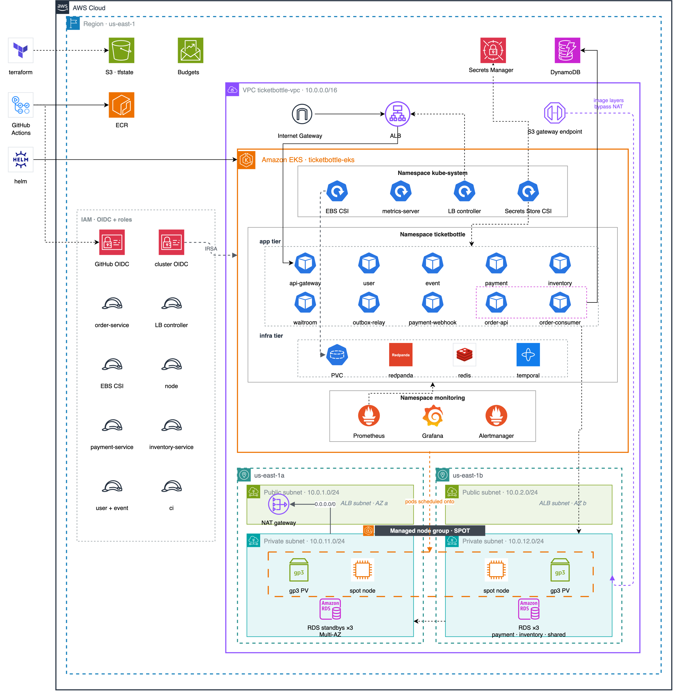
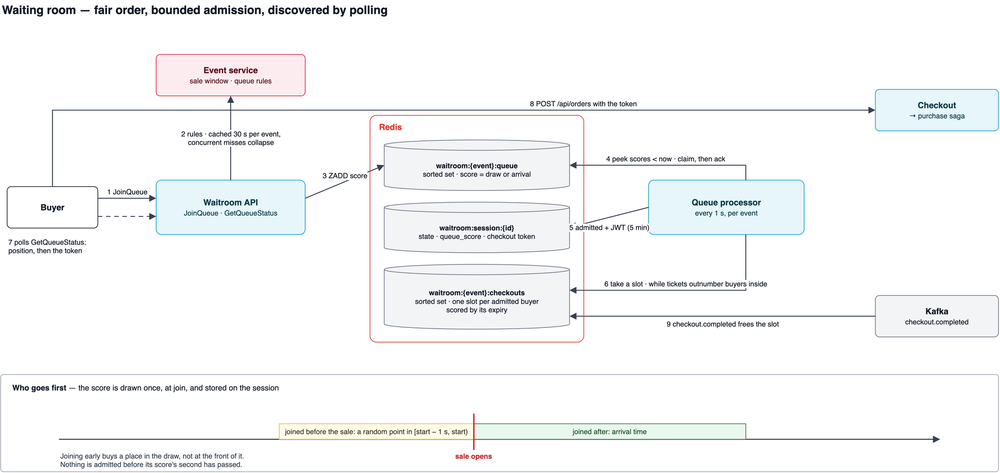
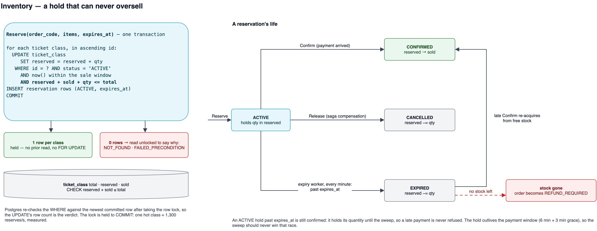
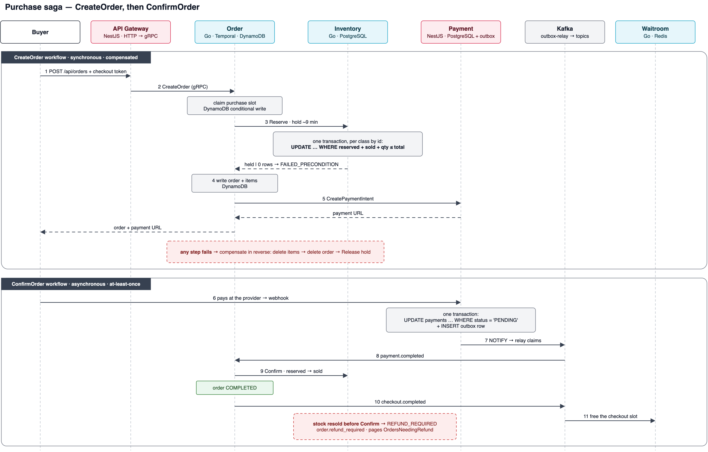
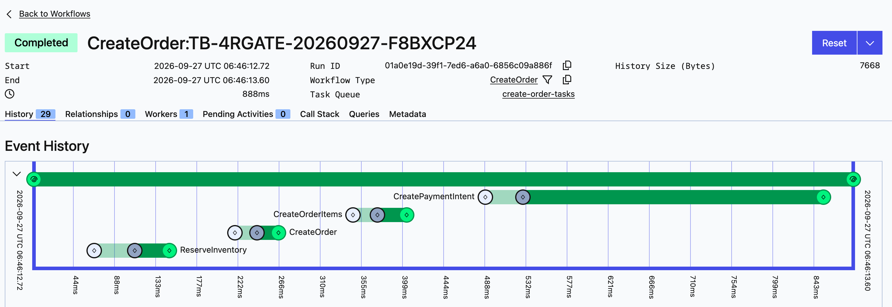
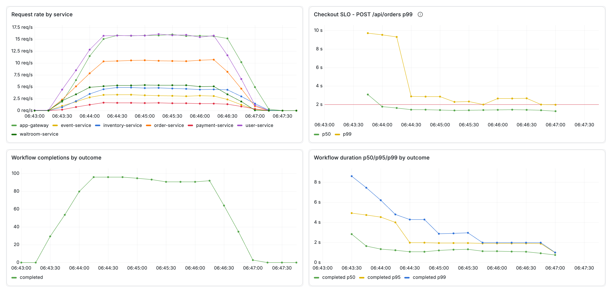

# TicketBottle

A distributed ticket-selling platform built for high-demand on-sales, where thousands of buyers compete for the same inventory in the same few seconds.

[](https://opensource.org/licenses/MIT)
[](https://golang.org/)
[](https://nestjs.com/)
[](https://grpc.io/)
[](https://temporal.io/)
[](https://kafka.apache.org/)
[](https://kubernetes.io/)
[](https://www.terraform.io/)

---

## Contents

- [Overview](#overview)
- [Architecture](#architecture)
- [How a purchase works](#how-a-purchase-works)
  - [The waiting room](#the-waiting-room)
  - [Inventory](#inventory)
  - [The purchase saga](#the-purchase-saga)
- [Services](#services)
- [Communication patterns](#communication-patterns)
- [Design decisions](#design-decisions)
- [Measured](#measured)
- [Repository layout](#repository-layout)
- [Running it](#running-it)
- [gRPC contracts](#grpc-contracts)
- [Deployment](#deployment)
- [Observability and security](#observability-and-security)
- [License](#license)

---

## Overview

A ticket on-sale is a worst-case concurrency problem: demand arrives as a spike, the inventory is finite and non-fungible, and every oversell is a refund and a support ticket. TicketBottle addresses that with four mechanisms working in sequence.

- **Virtual waiting room.** Buyers who arrive before the sale are ordered by a random draw, later arrivals by arrival time, and admitted into checkout a bounded number at a time, so the services behind never see the full spike.
- **Inventory that cannot oversell.** A reservation is one guarded `UPDATE` that succeeds only while stock remains, so the database itself refuses the seat that is not there. A timed hold returns abandoned carts to sale.
- **Orchestrated saga.** A purchase spans three services and three databases, so no single ACID transaction can cover it. A durable Temporal workflow runs the steps and compensates precisely if any of them fails.
- **Transactional outbox.** Payment writes its state change and its outgoing event in the same transaction, so a crash between the two cannot lose the event — and an event that can never be published pages someone.

The platform is polyglot by design: Go for the concurrency- and latency-sensitive path, TypeScript/NestJS for the richer business domains.

---

## Architecture

A single HTTP gateway is the only public entry point; every service behind it speaks gRPC. Cross-service notifications travel over Kafka. The diagram below shows the system on its Amazon EKS target — the workload topology is identical wherever it runs, since one Helm chart serves every target.



The node group sits in private subnets and reaches the internet through a NAT gateway,
which is the layout AWS recommends. Both are created by the ephemeral `envs/eks` stack,
so `terraform destroy` takes the NAT's meter with it — see `private_nodes` under
Deployment.

---

## How a purchase works

### The waiting room



A buyer joins the queue for an event and is given a score once, at join: a random point in the second before the sale opens if they arrived early, their arrival time otherwise. Gathering early buys a place in the draw, not at the front of it, so an on-sale is not a race on round-trip time. A processor admits buyers each second, a few at a time and only while the event has more tickets available than buyers already inside, and each admitted buyer receives a checkout token valid for 5 minutes, the time they have to start a checkout. The buyer learns this by polling: there is no push stream to hold open per waiter. A completed checkout frees the slot, and a slot that is never used expires on its own.

### Inventory



Availability is decided inside the `UPDATE` itself. Under `READ COMMITTED`, Postgres re-checks the `WHERE` clause against the newest committed row after taking the row lock, so a row count of zero is a correct "sold out" with no prior read and no `SELECT … FOR UPDATE`. A hold is keyed by order code, which makes `Reserve`, `Confirm` and `Release` safe to retry. It outlives the payment window by a grace period, and a payment that arrives after its hold was swept re-acquires the seat from free stock if any remains.

### The purchase saga



`CreateOrder` runs synchronously inside the checkout request: reserve the tickets, write the order, create the payment intent, and on any failure undo the completed steps in reverse. Payment completes out of band. The provider's webhook flips the payment from `PENDING` with a compare-and-set and writes the outbox row in the same transaction; a long-lived relay publishes it to Kafka, and `ConfirmOrder` turns the hold into a sale. Delivery is at-least-once, so every step on this side is idempotent.

A buyer who loses the race for the last ticket is refused by `Reserve` before any order is written. A buyer who paid after their hold was swept and resold becomes `REFUND_REQUIRED`, which pages: that is money owed, not a lost race.



*One `CreateOrder` run from a load test, in the Temporal UI. The payment intent, the one call that leaves the cluster, is the longest step.*

---

## Services

Seven services plus two workloads that carry the payment event path.

| Service | Directory | Stack | Port | Protocol | Datastore |
|---------|-----------|-------|------|----------|-----------|
| API Gateway | `services/api-gateway` | TypeScript / NestJS | 3000 | HTTP + REST | none (gRPC client to all) |
| User | `services/user-svc` | TypeScript / NestJS | 50052 | gRPC | PostgreSQL (Prisma) |
| Event | `services/event-svc` | TypeScript / NestJS | 50053 | gRPC | PostgreSQL (Prisma) |
| Order | `services/order-svc` | Go / Temporal | 50054 | gRPC | DynamoDB |
| Payment | `services/payment-svc` | TypeScript / NestJS | 50055 | gRPC | PostgreSQL (Prisma) |
| Waitroom | `services/waitroom-svc` | Go | 50056 | gRPC | Redis |
| Inventory | `services/inventory-svc` | Go / GORM | 50057 | gRPC | PostgreSQL |

**API Gateway** terminates HTTP, validates requests, enforces JWT authentication, maps gRPC status codes onto HTTP responses, and translates REST into internal gRPC calls. It owns no database.

**User** handles registration, authentication, profiles, and email verification.

**Event** manages events, organizers, and configuration, with a lifecycle of `DRAFT → CONFIGURED → APPROVED → PUBLISHED` and role-based access control.

**Order** is the saga orchestrator. Temporal workflows (`CreateOrder`, `ConfirmOrder`) coordinate Event, Inventory, and Payment, and compensate automatically at whatever point a purchase fails. It runs as two workloads — an API server and a Kafka consumer — against a single-table DynamoDB design.

**Payment** integrates ZaloPay and PayOS behind one interface, with VNPay planned, handles provider webhooks idempotently, and records outgoing events in an outbox table written in the same transaction as the payment update.

**Waitroom** implements the virtual queue on Redis sorted sets. A background processor admits users as checkout slots free up and issues short-lived checkout tokens.

**Inventory** holds ticket classes and quantities. Its three-step `Reserve → Confirm | Release` flow never lets a counter pass capacity: `Reserve` is a guarded conditional `UPDATE`, and a sweeper expires stale holds.

---

## Communication patterns

**gRPC — when the caller needs an answer.** Reserving inventory or creating a payment intent must return a result before the flow can continue. Protocol Buffers give typed contracts and generated stubs that keep every service in step with the contract.

**Kafka — when the caller must not wait.** Once a payment succeeds, the order confirms and the waiting room frees a slot, but none of those should block on each other.

| Topic | Producer | Consumer |
|-------|----------|----------|
| `payment.completed`, `payment.failed`, `payment.cancelled` | Payment | Order |
| `checkout.completed`, `checkout.failed`, `checkout.expired` | Order | Waitroom |
| `order.refund_required` | Order | — (pages instead) |
| `queue.joined`, `queue.left`, `queue.ready` | Waitroom | — |

Delivery is at-least-once, so every consumer is idempotent, and no consumer skips a message it failed to handle. Order leaves a failed message uncommitted, so it is delivered again; the waiting room retries in place and parks what still fails on a `<topic>.dlq` companion topic.

**Temporal workflows — when the process is long-running and must survive a crash.** Workflow state is durable, steps are retried automatically, and compensation is explicit.

---

## Design decisions

Each of these is recorded in [`docs/decisions/`](docs/decisions/README.md) with the option not taken and what the choice costs.

**Saga with Temporal, not two-phase commit.** A purchase touches three databases owned by three services. Temporal supplies durable execution, automatic retries, and an explicit compensation path; the cost is a workflow engine to operate and an idempotency requirement on every activity.

**A guarded `UPDATE`, not a locked read, in Inventory.** The capacity check lives in the `UPDATE`'s own `WHERE` clause, so correctness needs no `SELECT … FOR UPDATE`; removing that read gained about 30%. The row lock the `UPDATE` takes still serializes one hot ticket class until `COMMIT`, so adding replicas buys nothing for a single class, and the service is deliberately not autoscaled.

**A draw, not a race, in the waiting room.** Ordering everyone who waited for the doors by arrival makes an on-sale a contest of network paths, which a bot always wins. The cost is that joining early buys a lottery ticket rather than the front of the line.

**Polling, not push, for admission.** A push stream per waiter meant a connection, a gRPC stream and a Redis subscription each, and a stampede became quadratic in queue depth. A poll costs two Redis round trips; the cost is that admission is seen on the next poll, seconds into a 5-minute token.

**Transactional outbox in Payment.** Updating the database and publishing an event are two writes to two systems, and a crash between them loses the event. Writing the event into an outbox table inside the payment transaction removes that window; a long-lived relay drains the table to Kafka, claiming rows with `FOR UPDATE SKIP LOCKED` and waking on `LISTEN/NOTIFY`.

**Polyglot persistence.** PostgreSQL where locking and ACID matter (users, events, payments, inventory), DynamoDB for orders queried by known keys, Redis for the queue where latency dominates. The trade-off is several engines to operate and no cross-store joins.

**One HTTP front door.** Centralizing authentication and validation at the gateway keeps internal services private and free of edge concerns, at the cost of a component that must stay available.

---

## Measured

Claims about behaviour under load are measured, and the measurement is kept with its method.

| What | Result | Method |
|------|--------|--------|
| One hot ticket class | About 1,300 reserves/s, peaking at four concurrent reservers | [Contention benchmark](docs/plans/2026-09-22-inventory-contention-benchmark.md) |
| End-to-end purchases on k3s | 310 of 310 completed; a later 3-minute run of 20 buyers completed 286 with no failed request | `make -C deploy k3s-load` |
| Checkout latency, 20 concurrent buyers on one node | 96.4% under 2 s (p50 1.4 s, p99 2.7 s) — short of the 99% objective | Gateway histogram, below |
| Rolling restarts under 50 req/s | Zero refused or cut requests across ten rollouts | [Rollout drain](docs/plans/2026-09-27-rollout-drain-fixes.md) |
| Kafka down, payment events waiting | About 13 minutes before an event stops retrying, and then it pages; a broker restart is back in 10 s | [Outbox measurement](docs/plans/2026-09-25-payment-outbox-tech-debt.md) |

---

## Repository layout

```
proto/                     gRPC contracts — the single source of truth
services/
  api-gateway/             HTTP entry point (NestJS)
  user-svc/  event-svc/    business domains (NestJS + Prisma)
  payment-svc/
  order-svc/               saga orchestrator (Go + Temporal)
  inventory-svc/           atomic inventory (Go + GORM)
  waitroom-svc/            virtual queue (Go + Redis)
deploy/
  helm/ticketbottle/       one chart, per-target values overlays
  terraform/               infrastructure as code
  scripts/                 bootstrap, deploy, and acceptance scripts
docs/ARCHITECTURE.md       design walkthrough, decision by decision
```

Each service carries its own `CLAUDE.md` with service-specific conventions.

---

## Running it

**A single service** runs natively against its own `docker-compose.dev.yml`, which starts only that service's datastore, so the service can run with hot reload. This needs Docker plus Go 1.25+ or Node.js 20+.

**The full stack** runs on k3s on a single EC2 instance, from the same Helm chart that deploys to EKS. It needs `kubectl`, `helm`, the AWS CLI and `make`; the images come from ECR, built by CI.

```bash
make -C deploy start-ec2-k3s   # start the instance; prints the SSH tunnel to open
make -C deploy k3s-kubeconfig
make -C deploy k3s-deploy      # deploy the chart from ECR
make -C deploy k3s-gate2       # end-to-end purchase-flow acceptance test
make -C deploy stop-ec2-k3s    # stop compute; data survives on EBS
```

Through the tunnel the gateway is reachable at `http://localhost:3000/api`, with Swagger UI at `http://localhost:3000/api/docs` in development. Per-service configuration lives in the chart's ConfigMaps, not in `.env` files.

---

## gRPC contracts

All six contracts live in `proto/` and are the single source of truth. Generated stubs are committed, so a fresh checkout builds without a code generator installed.

```bash
make proto        # regenerate every consumer
make proto-go     # Go services only
make proto-ts     # TypeScript services only
```

Edit the contract in `proto/`, regenerate, and commit the result. Never hand-edit generated code.

---

## Deployment

One Helm chart deploys the platform to every target. The workload topology never changes; the target is selected by a values overlay plus an infrastructure delta, never by forking a manifest.

| Target | Overlay | Images | Orders store | Ingress |
|--------|---------|--------|--------------|---------|
| k3s on a single instance | `values-k3s.yaml` | ECR | DynamoDB | NodePort |
| Amazon EKS | `values-eks.yaml` | ECR | DynamoDB | ALB |

Infrastructure is Terraform, split into composable modules under `deploy/terraform/`. Images are built in GitHub Actions and pushed to ECR.

**No workload holds a long-lived AWS credential.** CI authenticates through GitHub OIDC federation, instances through an EC2 instance profile, and pods on EKS through IRSA. The EKS node role is deliberately granted no DynamoDB access, and the node launch template caps the IMDS hop limit at 1 so a pod cannot reach that role to begin with — a working purchase flow is therefore proof that the pod-level identity is what authenticated.

EKS nodes default to public subnets, which AWS documents as a valid layout on the condition that security groups carry the exposure; the cluster admits nothing from `0.0.0.0/0` and the API endpoint is pinned to one address. Setting `private_nodes = true` moves them to private subnets behind a NAT gateway — AWS's recommended layout — for roughly $0.22 on a two-hour session, since the cluster is ephemeral and NAT bills hourly.

See [`deploy/README.md`](deploy/README.md) for the chart and infrastructure detail.

---

## Observability and security

**Metrics.** Every workload publishes the same three gRPC metrics on port 2112, labelled by `service`, `method` and gRPC `code` ([the contract](docs/METRICS.md)). Prometheus evaluates 5 recording and 10 alerting rules, and Grafana provisions three dashboards: the gateway, the saga, and the queue and outbox.

**The error taxonomy is the alerting policy.** `INTERNAL` means we have a bug and pages on any sustained rate. `FAILED_PRECONDITION` — sold out, sale closed — never pages, because a buyer losing a race is not a fault and paging on it would turn a successful on-sale into an incident. The one exception is decided by the ledger rather than the code: an order that took money and holds no ticket pages.

**The checkout objective** is 99% of `POST /api/orders` under 2 seconds, measured at the gateway because that is the request the buyer makes, with fast and slow multi-window burn-rate alerts.



*A 3-minute run of 20 concurrent buyers on a single k3s node. The ramp breaches the 2 s objective and steady state sits just above it: 96.4% of checkouts finished under 2 s against a 99% target.*

**Logging.** Structured logs throughout — Winston in the TypeScript services, Uber Zap in the Go services. Temporal contributes full workflow execution history for the saga.

**Security.** JWT authentication with role-based access control, request validation on every endpoint, parameterized queries, argon2 password hashing at the gateway, and a CORS allowlist. The gateway sets security headers and throttles sign-in and sign-up per client.

---

## License

MIT. Author: Vo Gia An (<vogiaan1904@gmail.com>).
